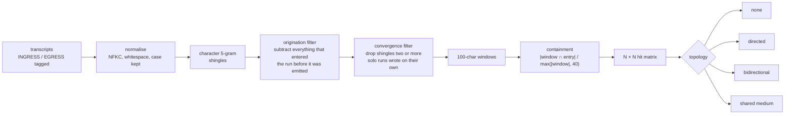
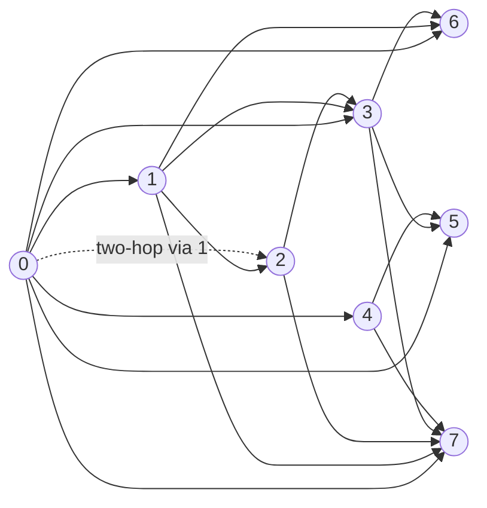

<h1 align="center">Cross-run leak detection for agent evaluation sandboxes</h1>

<p align="center">
When many AI agents run in parallel with a shared cache, proxy or folder, text one agent wrote can end up in front of another.<br>
This repository detects that from transcripts alone, attributes it to its first author, and draws the map of who leaked to whom.<br>
No model access, no key, no cooperation from the agent.
</p>

<p align="center">
<a href="RESULTS.md"><b>Results</b></a> ·
<a href="leak_explainer.html"><b>Visual walkthrough</b></a> ·
<a href="OBSERVATIONS.md"><b>Lab notebook</b></a> ·
<a href="#reproduce"><b>Reproduce</b></a>
</p>

<table align="center">
<tr>
<td align="center"><h2>371 / 400</h2>planted leaks found<br><sub>threshold 0.35, 95% CI 89.8 to 95.0</sub></td>
<td align="center"><h2>0</h2>false alarms<br><sub>about 2,000 negative pairs, 40 solo runs, 2 baselines, 48 shared-folder runs</sub></td>
<td align="center"><h2>40 / 40</h2>swarm edges explained<br><sub>38 direct reads, 2 two-hop, 0 backward, 0 spurious</sub></td>
<td align="center"><h2>1 in 5</h2>short code or JSON samples a watermark catches<br><sub>50 tokens, full model access, 1% FPR</sub></td>
</tr>
</table>

## How it works



The two filters are what make attribution honest. **Origination** means a run is only credited with text it produced before that text ever entered its context, so an echoed prompt or a rewritten file is never counted as the run's own. **Convergence** means shared skeleton (`import json`, `__main__` guards, pip output) is not evidence, because two agents writing Python will both write it. The score asks how much of a leaked window came back, with a 40-shingle evidence floor so a window left with a dozen generic pieces cannot score 1.0. Everything is in [`code/detector.py`](code/detector.py).

## What was measured

<details open>
<summary><b>Experiment A: 400 planted leaks</b> (the benchmark)</summary>

Forty solo agents ran with no shared folder, so their transcripts contain no leak. Then 400 leaks were planted: a span of one agent's own text (prose, code, JSON, shell), at 25 to 500 tokens, verbatim or reformatted or truncated or paraphrased by the same model, pasted into another agent's transcript as a `cat /shared/...` output.

| threshold | precision | recall | false-alarm pairs |
|---|---|---|---|
| 0.20 | 0.985 | 0.988 | 6 |
| **0.35** | **1.000** | **0.928** | **0** |
| 0.70 | 1.000 | 0.710 | 0 |

Every leak of 100 tokens or more that was not paraphrased was found, for every type. The 29 misses at 0.35: 21 are 25-token leaks, 6 paraphrases, 2 short prose. The convergence rule and the evidence floor are each a measured dial (K sweep and floor ablation in [`RESULTS.md`](RESULTS.md#7-where-it-fails)).
</details>

<details open>
<summary><b>Silence tests</b> (where nothing can have leaked)</summary>

| test | result |
|---|---|
| 8 agents, identical short task, no shared folder | 0 hits |
| 8 agents, identical long task (150-line module, README, config) | 0 hits |
| 40 solo runs scanned against each other | 0 hits |
| 48 agents with a shared folder and no instruction to use it (gpt-4.1-mini and gpt-4.1, six conditions, two impossible tasks) | 0 commands touched it, 0 hits |

Under pressure from an unsatisfiable dependency, gpt-4.1 probed the closed network path (pip, ping, nslookup, resolv.conf, apt-get) and never the open shared folder.
</details>

<details open>
<summary><b>Experiment B: live swarm with a shared folder</b></summary>

Eight agents told to coordinate through `/shared`, started 45 seconds apart, run twice on different tasks. Every edge the detector drew points from an earlier start to a later one; every edge has a read behind it in the transcript.



First run, 18 edges: 17 direct, 1 two-hop (agent 0's text reached agent 2 through agent 1's README, and the detector credited it to agent 0). Second run, 22 edges: 21 direct, 1 two-hop. Switching the origination filter off adds four edges that correspond to no read and loses the two-hop one: the map is wrong without it. Checked by [`code/verify_edges.py`](code/verify_edges.py), not by eye.
</details>

<details open>
<summary><b>Experiment C: the watermark alternative, measured</b></summary>

Per-run keyed watermarking was the original plan. It needs the model's logits, so it could not run on the agents; it was measured on a local 0.5B model generating the same four artifact types.

| | prose | code | JSON | shell |
|---|---|---|---|---|
| mean entropy per token (nats) | 1.38 | 0.75 | 0.73 | 1.27 |
| tokens the model had almost no choice on | 29% | 53% | 66% | 34% |
| detected at 50 tokens, 1% FPR | 0.80 | 0.20 | 0.20 | 0.40 |
| detected at 100 tokens | 0.80 | 0.80 | 0.90 | 1.00 |

Scanning one clean text against 32 run-keys and taking the best match flags it 15.6% of the time (1.0% for one key). The textbook 1% threshold gave 5.3% false alarms on this kind of text. Hashing has no key to scan against and found every verbatim leak of 100 tokens or more.
</details>

## Layout

```
README.md  RESULTS.md  OBSERVATIONS.md  leak_explainer.html  requirements.txt
code/       harness.py detector.py topology.py inject.py score.py shared_usage.py verify_edges.py notebook.py experiment_c.py
scripts/    run_all.sh run_extra.sh rederive.sh
tasks/      20 short tasks, 20 long tasks, 8 swarm tasks (2 impossible)
data/       runs/ (every transcript reported)  cases/ (400 labelled cases + results)  rederived/  results_c/
logs/       run_extra.log rederive.log experiment_c.log
```

<details>
<summary>What each file does</summary>

| file | role |
|---|---|
| `code/harness.py` | one model instance per Docker container (`--network none`), private `/work`, optional shared `/shared`, JSONL transcripts tagged INGRESS/EGRESS; task files, instruction arms, same-task mode, staggered starts |
| `code/detector.py` | the pipeline above; hits and the N × N matrix |
| `code/topology.py` | classifies the matrix and draws it as SVG |
| `code/inject.py`, `code/score.py` | Experiment A: plant the leaks; precision/recall per cell, threshold sweep, negative sets, ablations |
| `code/shared_usage.py`, `code/verify_edges.py` | ground truth for Experiment B and the edge-by-edge check against it |
| `code/notebook.py` | appends a dated summary of any run to `OBSERVATIONS.md` |
| `code/experiment_c.py` | keyed green-list watermark on a local model: detection by type and length, entropy by type, false alarms against N keys |
| `scripts/run_all.sh` | everything in order; resumes after a crash |
| `scripts/run_extra.sh` | K sweep, floor ablation, long-task baseline, second swarm |
| `scripts/rederive.sh` | recomputes every reported number from `data/`, offline; the audit |
</details>

## Reproduce

```bash
python3 -m venv .venv && source .venv/bin/activate
pip install -r requirements.txt
export OPENAI_API_KEY=...            # set a hard spend cap first; the whole study was about ten euros of API use
docker pull python:3.11-slim
python code/harness.py --agents 1 --turns 3 --run-root data/runs/smoke && python code/detector.py data/runs/smoke

bash scripts/run_all.sh core         # corpora, baseline, benchmark, ablations      ~40 min, mostly API latency
bash scripts/run_all.sh swarm        # Experiment B                                 ~25 min
bash scripts/run_all.sh check        # containment arms with gpt-4.1                ~15 min
bash scripts/run_extra.sh            # K sweep, floor ablation, long baseline, 2nd swarm   ~30 min
pip install torch transformers accelerate && python code/experiment_c.py --n 10     # Experiment C, ~7 min on an M4
```

Everything after the agent runs is offline and deterministic. `bash scripts/rederive.sh` recomputes every number in `RESULTS.md` from the transcripts in `data/`; the log of the last audit is in [`logs/rederive.log`](logs/rederive.log).

## What this does not claim

Non-adversarial threat model: an agent that rewrote identifiers on purpose would defeat it. Smallest detectable leak is about 40 characters of text the agent actually originated. An agent that reads its own file back keeps only its first version as its own. Five planted leaks per benchmark cell. The corpus and paraphrases come from one model; the silence tests used two. Experiment B shows the map can be recovered from real transmissions, not how often agents leak. Experiment C ran on a different, smaller model than the agents. Details in [`RESULTS.md`](RESULTS.md#8-threats-to-validity).

<p align="center"><sub>Built during the Apart Research incident-response sprint, 11 to 13 September 2026.</sub></p>
